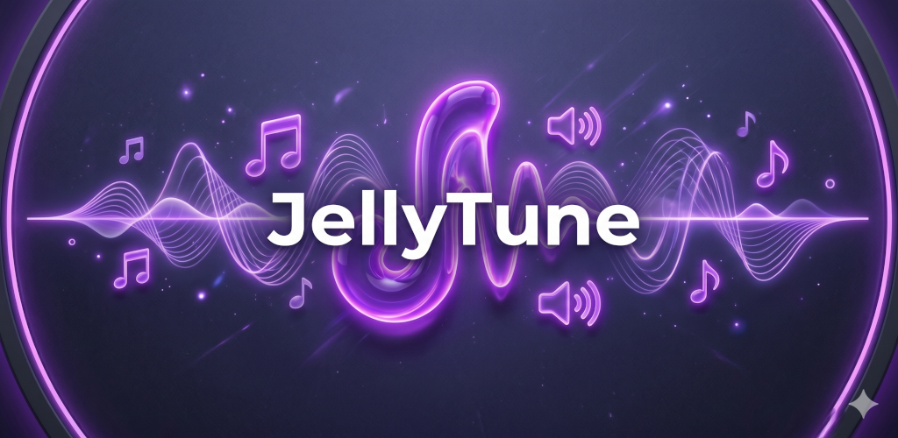

# 🎵 JellyTune

<p align="center">
  
</p>

[](https://www.gnu.org/licenses/gpl-3.0)
[](#)
[](#)

JellyTune is a sleek, lightweight, open-source audio client designed specifically for your self-hosted **Jellyfin** server. Inspired by the elegant visual philosophy of classic Material players like Phonograph, JellyTune is built from the ground up for the ultimate high-fidelity mobile audio experience.

---

## 📸 Project Gallery

Browse the high-fidelity user interface and rich features of JellyTune:

<p align="center">
  <table align="center" cellspacing="10" cellpadding="10" border="0">
    <tr>
      <td align="center" valign="top" width="31%">
        <br>
        <sub><b>Rounded Artist Avatars</b></sub>
      </td>
      <td align="center" valign="top" width="31%">
        <br>
        <sub><b>Responsive Album Grid</b></sub>
      </td>
      <td align="center" valign="top" width="31%">
        <br>
        <sub><b>Z-A Grid Navigation</b></sub>
      </td>
    </tr>
    <tr>
      <td align="center" valign="top" width="31%">
        <br>
        <sub><b>Direct Tracks Explorer</b></sub>
      </td>
      <td align="center" valign="top" width="31%">
        <br>
        <sub><b>Detailed Tracks Registry</b></sub>
      </td>
      <td align="center" valign="top" width="31%">
        <br>
        <sub><b>Custom Active Album Card</b></sub>
      </td>
    </tr>
    <tr>
      <td align="center" valign="top" width="31%">
        <br>
        <sub><b>Full Artwork Hero Player</b></sub>
      </td>
      <td align="center" valign="top" width="31%">
        <br>
        <sub><b>Offline Cache Controls</b></sub>
      </td>
      <td align="center" valign="top" width="31%">
        <br>
        <sub><b>Audio Tweaks & About Build</b></sub>
      </td>
    </tr>
  </table>
</p>

*💡 **How to link these screenshots on GitHub:** Simply drag and drop your local screenshots into the `/screenshots` directory at the project root, renaming each file to match its respective spot in the gallery:*
1. `01_artists_explorer.png`
2. `02_albums_explorer_various.png`
3. `03_albums_explorer_alphabetical.png`
4. `04_tracks_list.png`
5. `05_album_details_acid_bath.png`
6. `06_album_details_ozric_tentacles.png`
7. `07_playing_overlay_background.png`
8. `08_settings_caching_storage.png`
9. `09_settings_playback_about.png`

Once placed, they will render beautifully when browsing your repository on GitHub!

---

## 🚀 Key Features

*   **⚡ Aggressive Offline-First Caching**: JellyTune's main differentiator. It automatically and preemptively caches whole tracks and entire albums. Say goodbye to buffer pauses on unstable mobile connections or when completely deep offline.
*   **🎨 Material Design 3 Aesthetic**: A visually stunning, high-contrast dark interface featuring responsive Material ripples, elegant typography pairings, and layouts that respect device edges and spacing seamlessly.
*   **❌ Constant Ad-Free Pure Music**: No trackers, no bloatware, and absolutely zero ads. Just your server, your library, and your music.
*   **🔒 Secure Caching Engine**: Your self-hosted credentials and tokens are stored locally and securely, communicating direct-to-server.
*   **📱 Seamless Android Integration**: Fully featured system media playback controls, notification tray integration, and persistent lock-screen audio session support.

---

## 🤖 Built with Google AI Studio

JellyTune is a premier showcase of **AI-driven software craftsmanship and rapid prototyping**. 

This entire production-ready Android application was designed, structured, built, and iteratively polished using **Google AI Studio's AI Coding Agent** in direct collaboration with the human creator. Through natural-language prompts, the AI Agent handled:
*   Perfecting the **Material 3 UI layouts** and customized XML adaptive launch icons.
*   Configuring complex **Media3 integration** for persistent, background playback controls.
*   Implementing **intelligent and aggressive caching engines** to buffer your audio files safely.
*   Managing gradle and automated deployment version configurations.

---

## 🛠️ Tech Stack & Setup

*   **Language**: modern Kotlin with Jetpack Compose for declarative UI.
*   **Media Engine**: Jetpack Media3 (ExoPlayer) with customizable media caches.
*   **Local Persistence**: Room SQLite database for tracking offline sync metrics and cache registries.
*   **Build Engine**: Gradle Kotlin DSL (`.gradle.kts@36`).

### Building from Source

1. Clone this repository:
   ```bash
   git clone https://github.com/Gimmeapill/JellyTune.git
   ```
2. Open the project in **Android Studio**.
3. Let Gradle sync and resolve dependencies.
4. Run inside an emulator or deploy straight to your device.

---

## 🤝 Acknowledgements

JellyTune stands proud on the shoulders of giants:

*   **[Jellyfin](https://github.com/jellyfin/jellyfin)**: For their world-class, free, and open media server ecosystem.
*   **[Phonograph](https://github.com/kabouzeid/Phonograph)**: For pioneering the clean, timeless art of beautiful Material Design audio layout architecture.
*   **[Google AI Studio](https://ai.studio/build)**: For powering the advanced, context-aware AI Coding Agent that engineered this codebase.
